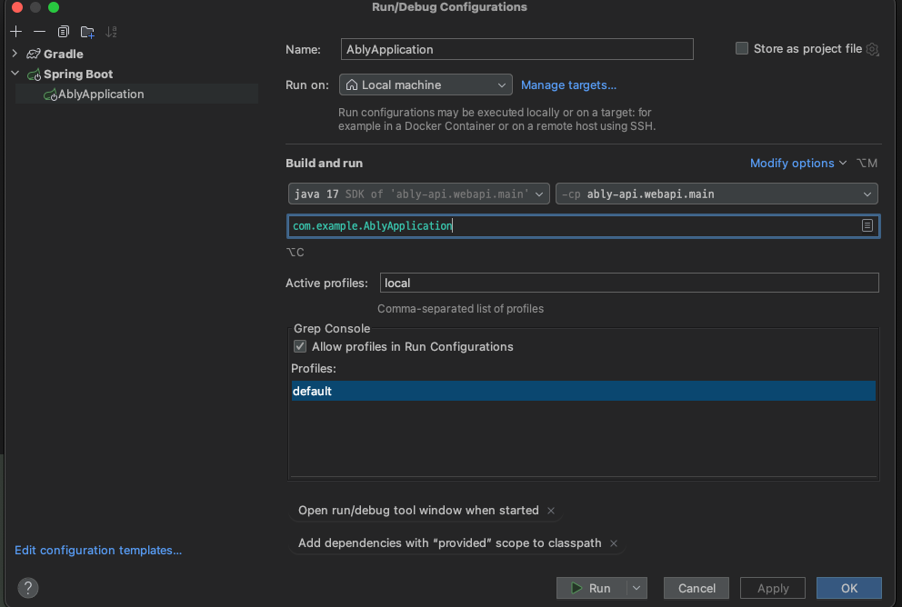

# ably-api
## 프로젝트 설명
- 찜 서랍과 찜 상품 목록을 다루는 API 서버

## 주요 기능
- HandlerInterceptor 를 이용한 JWT 토큰 처리
- HandlerMethodArgumentResolver 를 이용한 유저 정보 처리
- 찜 서랍 <-> 찜 상품 관계 매핑

## 사용 기술
- Kotlin, Spring Boot, Spring Data JPA, Docker, TestContainer

## API 명세
- http://localhost:8080/api/swagger-ui/index.html#/
- ably.http 파일을 통한 로컬 API 테스트 

## 로컬 실행 방법
- IntelliJ 설정

- cli 에서 명령어 실행
```docker-compose up -d```
- ably.http 파일을 이용하여 API 로컬 테스트


